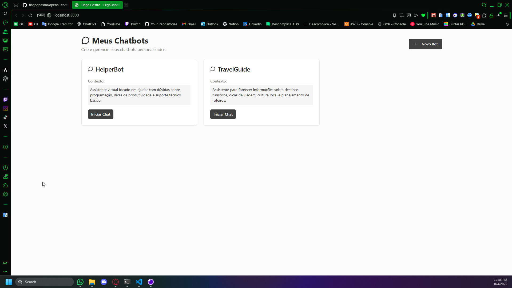
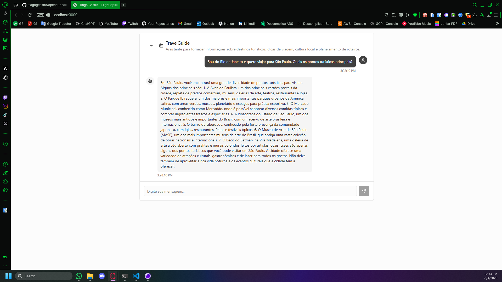

# 💬 Chatbot App - Fullstack

Este projeto é uma aplicação fullstack de chatbot com backend em ASP.NET Core 6 e frontend em React (Vite). A proposta é oferecer uma interface simples e moderna para interações com bots conectados à API da OpenAI (ChatGPT), com persistência via SQLite.

## 🧠 Objetivo

Permitir a criação de múltiplos bots com contextos personalizados e interação em tempo real com respostas geradas por IA. O sistema é dividido entre:

- **Backend**: API REST em C# com Entity Framework Core e SQLite.
- **Frontend**: Aplicação SPA com React, TailwindCSS e componentes acessíveis com ShadCN.

## ⚙️ Tecnologias principais

- ASP.NET Core 6 + EF Core + SQLite
- React + Vite + TypeScript
- TailwindCSS + ShadCN UI + Radix UI
- Axios para consumo de API
- Zod para validação de dados
- OpenAI (ChatGPT) como motor de IA
- Docker para ambiente padronizado

---

## 🚀 Como Iniciar o Projeto Completo (Docker)

### Pré-requisitos
* Docker Desktop instalado e em execução.

### 1: Clonar o repositório
`git clone <url-do-repositorio>`

`cd HighCapital-Desafio-Tecnico`

### 2. Configurar o arquivo de ambiente
Na raiz do projeto, copie o arquivo `.env.example` para `.env` e configure suas variáveis, incluindo a chave da API da OpenAI.

```bash
cp .env.example .env
```

### 3. Subir o ambiente completo
Execute o comando abaixo na raiz do projeto para construir as imagens e iniciar os contêineres do backend e do frontend. As migrations do banco de dados serão aplicadas automaticamente no início.

```bash
docker compose up --build
```

### 4. Acessar a aplicação
  - **Frontend**: http://localhost:3000
  - **Backend (API)**: http://localhost:5000

---

#### Listagem dos bots do chatbot


#### Mensagens do chatbot


---

## 📄 Licença

Projeto criado por [Tiago Castro](https://www.linkedin.com/in/tiagogoncalvesdecastro) como parte do desafio técnico da HighCapital.
